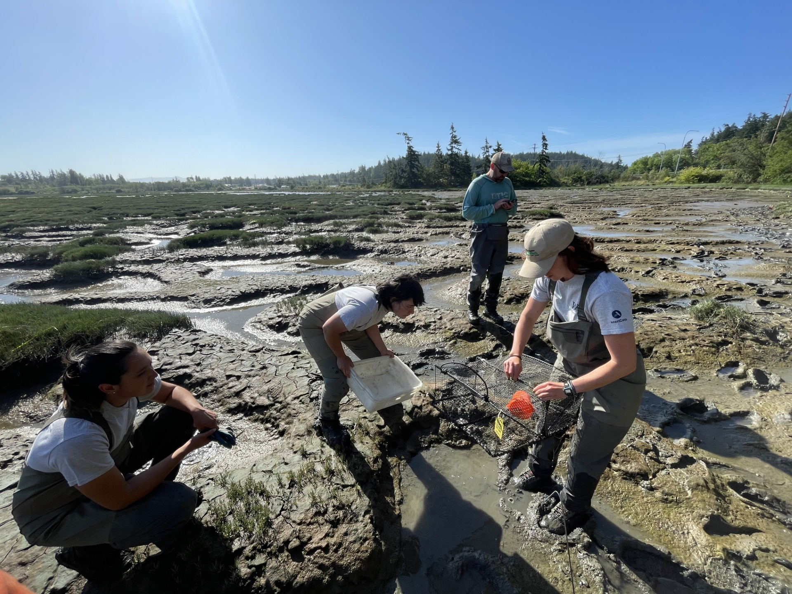
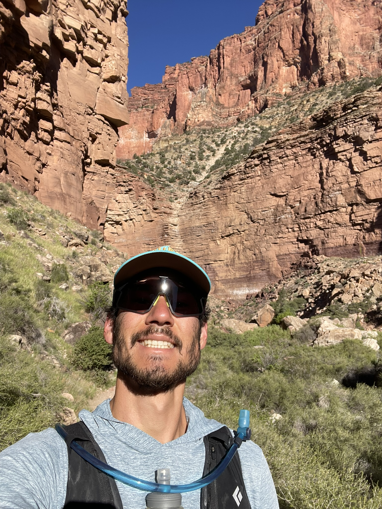
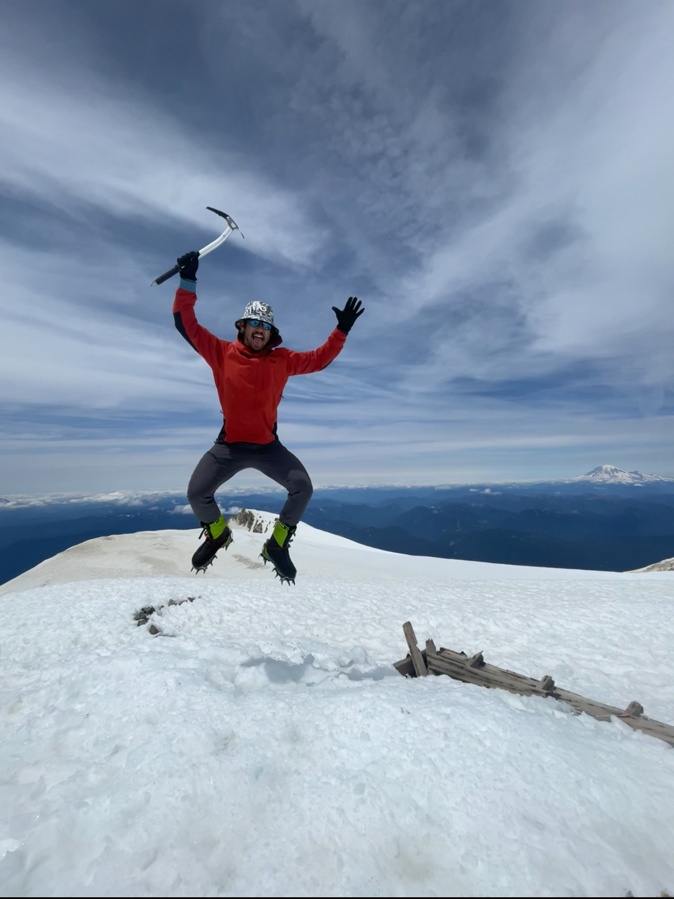
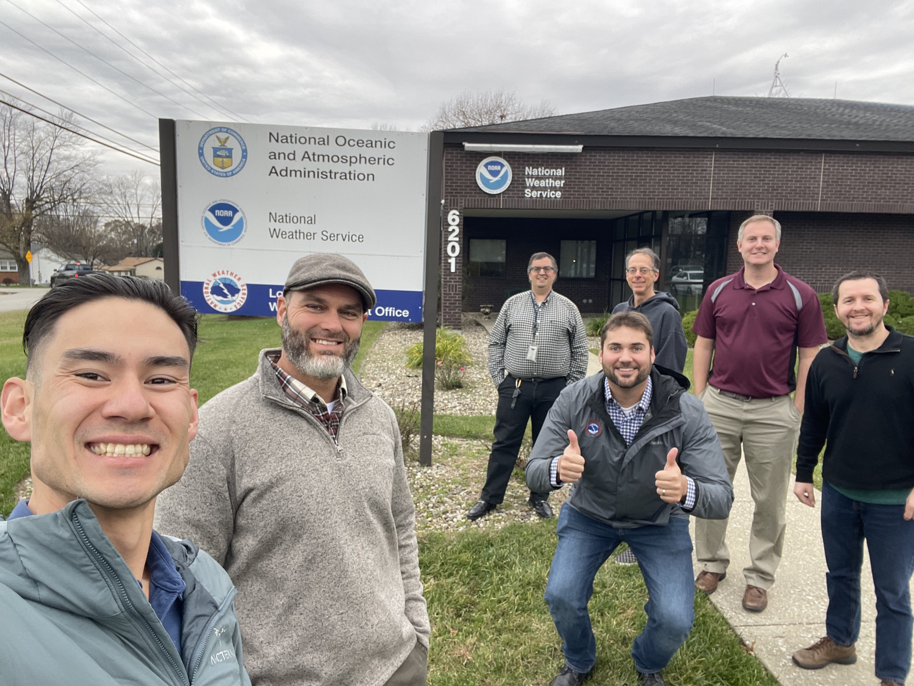

## Hey there!

I'm Daniel, a watershed science graduate student at Colorado State University and a member of the Radical Open Science Syndicate Lab.

My research examines how changes in streamflow regimes impact water quality. I’m interested in understanding how data can inform decisions in water resource management & hazard mitigation.

Building on my previous work as a data systems engineer, I enjoy tinkering with IoT devices and building mesh network infrastructure. I hope to create a low-cost, low-maintenance water-monitoring system that uses a self-healing LoRa mesh network.

I'm passionate about open data and committed to sharing knowledge and resources to advance our understanding of the hydrosphere. When not in the lab, I'm exploring rivers, climbing mountains, or bikepacking.

### Thanks for stopping by!

::: {layout-ncol=2}

:::

