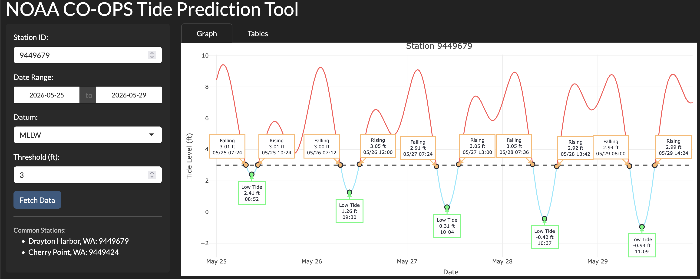

## Featured Projects

::: {.grid}

<!-- Project 1 -->
::: {.g-col-12 .g-col-md-6 .g-col-lg-4}

::: {.card .h-100}

{.card-img-top}

::: {.card-body}

### NOAA CO-OPs Tide Planning Application
A Shiny app built to help the Northwest Straits Commission and coastal communities with field planning by visualizing NOAA CO-OPs tide data and forecasts. Users can input a location, date range, and tide threshold to determine what time window is best for field work.
 
[View Project](https://danny-duncan.shinyapps.io/tide-planning-app/){.btn .btn-outline-primary .btn-sm role="button"}
:::
:::

:::

<!-- Project 2 -->
::: {.g-col-12 .g-col-md-6 .g-col-lg-4}
::: {.card .h-100}

{.card-img-top}

::: {.card-body}

### Project Title
Project Description
 
[View Project](https://your-link-here.com){.btn .btn-outline-primary .btn-sm role="button"}
:::
:::
:::

<!-- Project 3 -->
::: {.g-col-12 .g-col-md-6 .g-col-lg-4}
::: {.card .h-100}
{.card-img-top}

::: {.card-body}

### Project Title
Project Description
 
[View Project](https://your-link-here.com){.btn .btn-outline-primary .btn-sm role="button"}
:::
:::
:::

:::

