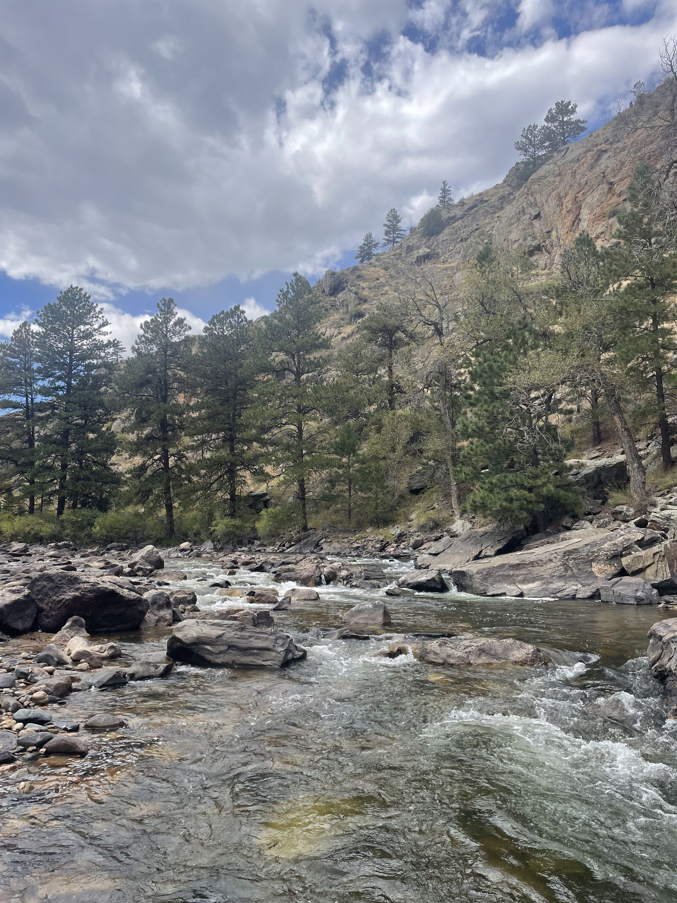
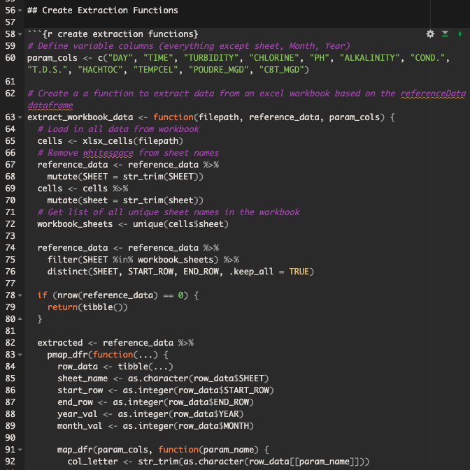

## Featured Projects

:::::::::::: grid

<!-- Project 1 -->

::::: {.g-col-12 .g-col-md-6 .g-col-lg-4}
:::: {.card .h-100}
{.card-img-top}

::: card-body
### Upper Cache la Poudre DSS

This decision-support system is designed to provide municipal water managers with current and future information on water quality and quantity. We create models of in-stream water quality using real-time data from a network of water-quality sondes throughout the Upper Cache la Poudre River. These models, developed by the ROSSyndicate Lab at Colorado State University, provide real-time and forecasted data, which are visualized through a Shiny dashboard for municipal water suppliers.  

[View Repository](https://github.com/rossyndicate/upper_clp_dss){.btn
.btn-outline-primary .btn-sm role="button"}
:::
::::
:::::

<!-- Project 2-->

::::: {.g-col-12 .g-col-md-6 .g-col-lg-4}
:::: {.card .h-100}
{.card-img-top}

::: card-body
### NOAA CO-OPs Tide Planning Application

A Shiny app built to help the Northwest Straits Commission and coastal
communities with field planning by visualizing NOAA CO-OPs tide data and
forecasts. Users can input a location, date range, and tide threshold to
determine what time window is best for field work.   

[View Repository](https://github.com/danny-duncan/tide-planning-app){.btn
.btn-outline-primary .btn-sm role="button"}
:::
::::
:::::

<!-- Project 3 -->

::::: {.g-col-12 .g-col-md-6 .g-col-lg-4}
:::: {.card .h-100}
{.card-img-top}

::: card-body
### Water Quality ETL Pipeline

Built with R, this codebase extracts, transforms, and loads 20+ years of water quality data from a municipal water treatment facility. The pipeline cleans and normalizes non-standardized data, saving it in .parquet format for efficient storage and analysis. This project serves as a foundation for data analysis and modeling efforts within the Upper CLP decision support system.  
An extract, transform, and load pipeline   

[View Repository](https://github.com/danny-duncan/upper_clp_dss/blob/main/scratch/alkalinity/1_greeley_extract_collate.Rmd){.btn
.btn-outline-primary .btn-sm role="button"}
:::
::::
:::::
::::::::::::
